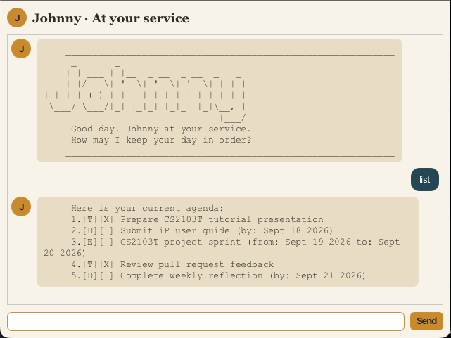

# Johnny User Guide

Johnny is a personal task manager with a friendly butler personality. It helps you keep track of todos,
deadlines, and events using short text commands in a graphical interface.



## Quick start

1. Ensure that Java 25 or later is installed.
2. Download `johnny.jar` from the [latest release](https://github.com/YujieJWang/ip/releases/latest).
3. Place the JAR in the folder where you want Johnny to store its data.
4. Open a terminal in that folder and run:

   ```bash
   java -jar johnny.jar
   ```

5. Type a command in the command field and press **Enter**, or click **Send**.

For example, enter `todo Review lecture notes`, followed by `list`.

## Command format

- Words in `UPPER_CASE` are values that you provide.
- `INDEX` is the number shown beside a task by `list`.
- Dates use the `yyyy-MM-dd` format, such as `2026-09-18`.
- Extra spaces before, after, or between command parts are ignored.
- Task descriptions cannot contain the `|` character.

## Features

### Adding a todo: `todo`

Adds a task without a date.

Format: `todo DESCRIPTION`

Example: `todo Review lecture notes`

### Adding a deadline: `deadline`

Adds a task that must be completed by a specific date.

Format: `deadline DESCRIPTION /by DATE`

Example: `deadline Submit user guide /by 2026-09-18`

### Adding an event: `event`

Adds a task spanning two dates. The start date must be earlier than the end date.

Format: `event DESCRIPTION /from START_DATE /to END_DATE`

Example: `event Project sprint /from 2026-09-19 /to 2026-09-20`

### Listing tasks: `list`

Displays every task and its index.

Format: `list`

### Marking a task as completed: `mark`

Marks the task at `INDEX` as completed.

Format: `mark INDEX`

Example: `mark 2`

### Marking a task as pending: `unmark`

Marks the task at `INDEX` as not completed.

Format: `unmark INDEX`

Example: `unmark 2`

### Deleting a task: `delete`

Deletes the task at `INDEX`.

Format: `delete INDEX`

Example: `delete 3`

### Finding tasks: `find`

Displays tasks containing the keyword. Matching is case-insensitive.

Format: `find KEYWORD`

Example: `find project`

### Undoing a change: `undo`

Reverses the most recent successful `todo`, `deadline`, `event`, `mark`, `unmark`, or `delete` command.
Johnny supports one undo at a time; after an undo, there is no earlier change to undo.

Format: `undo`

### Exiting Johnny: `bye`

Closes Johnny.

Format: `bye`

## Saving data

Johnny automatically saves tasks after every task-changing command. Data is stored in `data/johnny.txt`
relative to the folder from which Johnny is run. Keep a backup before editing this file manually.

## Command summary

| Action | Command |
| --- | --- |
| Add a todo | `todo DESCRIPTION` |
| Add a deadline | `deadline DESCRIPTION /by DATE` |
| Add an event | `event DESCRIPTION /from START_DATE /to END_DATE` |
| List tasks | `list` |
| Mark completed | `mark INDEX` |
| Mark pending | `unmark INDEX` |
| Delete a task | `delete INDEX` |
| Find tasks | `find KEYWORD` |
| Undo the last change | `undo` |
| Exit | `bye` |
